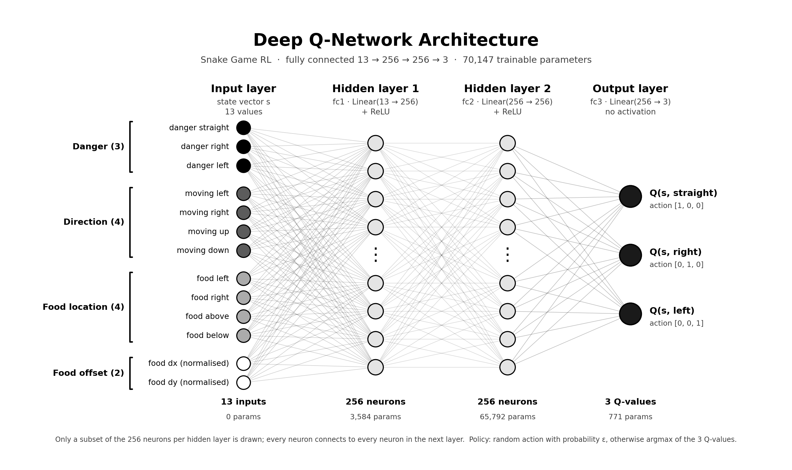

# 🐍 Snake Game RL (Deep Q-Learning)

An autonomous Snake game agent trained using **Deep Q-Learning (DQN)** built with **PyTorch** and **Pygame**.

The agent learns to navigate the grid, avoid obstacles and self-collisions, and hunt for food using an $\epsilon$-greedy exploration strategy and experience replay.

---

## 🚀 Features

- **Reinforcement Learning:** Deep Q-Network (DQN) with target network updates.
- **Experience Replay:** Memory buffer to stabilize training by breaking correlations between consecutive steps.
- **Dynamic Exploration:** Configurable $\epsilon$-decay rate to balance exploration vs. exploitation.
- **Live HUD Display:** Real-time metrics showing game count, current score, high score, and current epsilon value.

---
<p align="center">
  
</p>

## 🧠 State & Action Space

### State (13-dimensional vector):
- **Danger (3):** Danger ahead, danger to the right, danger to the left
- **Current Direction (4):** Moving left, right, up, or down
- **Food Location (4):** Food is left, right, above, or below snake's head
- **Food Distance (2):** Relative horizontal and vertical offsets to food

### Actions (3 options):
- `[1, 0, 0]` $\rightarrow$ Continue Straight
- `[0, 1, 0]` $\rightarrow$ Turn Right
- `[0, 0, 1]` $\rightarrow$ Turn Left

---

## 🛠️ Installation

1. **Clone the repository:**
   ```bash
   git clone https://github.com/pingsabinbaral-ux/SnakeGameRL.git
   cd SnakeGameRL
